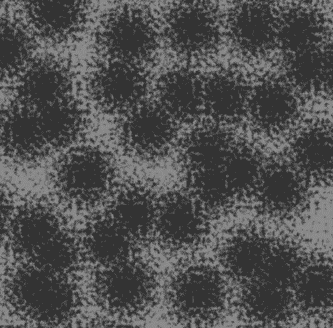
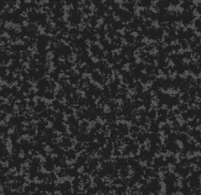
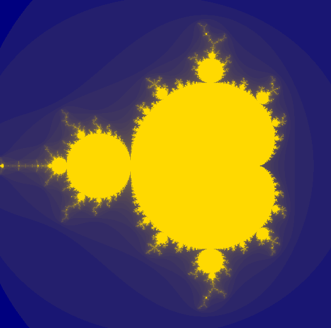

# ProceduralShader

Набор плагинов для Godot Engine 4.3, реализующих инструментарий процедурной генерации текстур с возможностью экспорта в Unity.

## Обзор

Проект состоит из двух плагинов, встраиваемых в редактор Godot как dock-панели:

**Procedural Baker** — универсальный инструмент для работы с canvas_item шейдерами. Автоматически парсит параметры любого шейдера, генерирует визуальный редактор, показывает превью в реальном времени и позволяет запечь результат в PNG для экспорта в Unity.

**L-System Editor** — редактор L-систем (формальных грамматик Линденмайера) с визуализацией, системой пресетов и экспортом в PNG.


---

## Содержание

- [Требования](#требования)
- [Установка](#установка)
- [Procedural Baker](#procedural-baker)
- [L-System Editor](#l-system-editor)
- [Экспорт в Unity](#экспорт-в-unity)
- [Шейдеры](#шейдеры)
- [Демонстрация работы](#демонстрация-работы)
- [Структура проекта](#структура-проекта)

---

## Требования

- **Godot Engine 4.3** (Forward+ renderer)
- **Unity 2022+** (URP или Standard) — для импорта текстур (опционально)

---

## Установка

### 1. Клонирование репозитория

```bash
git clone https://github.com/<username>/ProceduralShader.git
```

### 2. Открытие проекта

Откройте папку проекта через Godot Engine 4.3: `Project → Import → выбрать папку`.

### 3. Активация плагинов

Перейдите в `Project → Project Settings → Plugins` и включите:

- **Procedural Baker** — появится dock-панель «Baker» в правой верхней части редактора
- **L-System Editor** — появится dock-панель «LSystem» в правой нижней части редактора

---

## Procedural Baker

### Что делает

Берёт любой `canvas_item` шейдер, автоматически распознаёт его параметры и строит визуальный редактор. Не нужно писать UI-код под каждый шейдер — плагин делает это сам.

### Как использовать

1. Поместите `.gdshader` файл в папку `res://shaders/`
2. Нажмите 🔄 в плагине — шейдер появится в выпадающем списке
3. Выберите шейдер — контролы сгенерируются автоматически
4. Настройте параметры — превью обновляется в реальном времени
5. Нажмите **«Запечь текстуру»** — PNG сохранится в папку экспорта
6. При необходимости — скопируйте результат в Unity

### Поддерживаемые типы параметров

| Тип в шейдере | UI-контрол |
|---------------|------------|
| `float` с `hint_range` | Слайдер |
| `float` без range | SpinBox |
| `int` | SpinBox (целое) |
| `bool` | CheckBox |
| `vec4 source_color` | ColorPicker |
| `vec2`, `vec3` | Группа SpinBox |
| `sampler2D` | Селектор шума (Perlin/Cellular/Simplex/Value) + загрузка из файла |

### Возможности

- Автоматическое сканирование шейдеров в `res://shaders/`
- Загрузка шейдера из произвольной папки через FileDialog
- Встроенный генератор шумовых текстур (Perlin, Cellular, Simplex, Value)
- Запекание в разрешении 256 / 512 / 1024 / 2048
- Выбор папки экспорта (сохраняется между сессиями)
- Экспорт метаданных в JSON (параметры шейдера для воспроизводимости)
- Копирование в Unity с автосозданием материалов

### Создание своего шейдера

Создайте файл `.gdshader` с типом `canvas_item`:

```glsl
shader_type canvas_item;

uniform float scale: hint_range(1.0, 32.0) = 8.0;
uniform float threshold: hint_range(0.0, 1.0) = 0.5;
uniform vec4 color1: source_color = vec4(1.0, 1.0, 1.0, 1.0);
uniform vec4 color2: source_color = vec4(0.0, 0.0, 0.0, 1.0);
uniform sampler2D noise_texture: repeat_enable;
uniform bool baking_mode = false;

void fragment() {
    // ваш код
    COLOR = vec4(col, 1.0);
}
```

Поместите файл в `res://shaders/`, нажмите 🔄 — плагин автоматически создаст слайдеры для `scale` и `threshold`, палитры для `color1` и `color2`, и селектор шума для `noise_texture`. Параметр `baking_mode` будет скрыт (используется автоматически при запекании).

---

## L-System Editor

### Что делает

Визуальный редактор L-систем — формальных грамматик, которые генерируют фрактальные кривые и растительные структуры из простых правил подстановки.

### Как использовать

1. Выберите встроенный пресет из выпадающего списка
2. Нажмите **«Сгенерировать»** — кривая отрисуется в превью
3. Измените параметры (угол, итерации, зум) — нажмите «Сгенерировать» снова
4. Для экспорта нажмите **«Экспортировать PNG»**

### Встроенные пресеты

| Пресет | Аксиома | Угол | Итерации | Результат |
|--------|---------|------|----------|-----------|
| Koch Curve | `F` | 90° | 4 | Квадратная фрактальная кривая |
| Sierpinski | `F-G-G` | 120° | 5 | Треугольник Серпинского |
| Plant | `X` | 25° | 5 | Ветвящееся растение |
| Dragon Curve | `FX` | 90° | 10 | Спиральный фрактал |

### Создание своей L-системы

1. Выберите **«✦ Создать свой...»** в списке пресетов
2. Введите аксиому (начальная строка, например `F`)
3. Добавьте правила подстановки (например `F → F+F-F-F+F`)
4. Настройте угол и количество итераций
5. Нажмите **«Сгенерировать»**
6. Нажмите **«Сохранить пресет»** — пресет сохранится и будет доступен после перезапуска

### Синтаксис L-систем

| Символ | Действие |
|--------|----------|
| `F`, `G` | Нарисовать линию вперёд |
| `+` | Повернуть вправо на угол |
| `-` | Повернуть влево на угол |
| `[` | Сохранить позицию и угол в стек |
| `]` | Восстановить из стека (ветвление) |

### Экспорт

- **PNG** — изображение 1024×1024, тёмный фон, зелёные линии
- **JSON** — метаданные: аксиома, правила, угол, шаг, итерации
- Папка экспорта настраивается и сохраняется между сессиями

---

## Экспорт в Unity

### Настройка Unity-проекта

1. Создайте папку `Assets/ProceduralImport/Editor/` в Unity-проекте
2. Поместите туда `AssetWatcher.cs` и `MaterialApplier.cs`
3. Создайте папку `Assets/ProceduralImport/Imported/`

### Процесс экспорта

1. В Godot: запеките текстуру через Procedural Baker
2. Нажмите **«Выбрать папку Unity»** → выберите `Assets/ProceduralImport/Imported/`
3. Нажмите **«Копировать в Unity»**
4. В Unity: `AssetWatcher` автоматически обнаружит файлы и создаст `.mat`
5. Через `Tools → Procedural Import → Apply Material` примените материал к объекту

### Что экспортируется

- `{имя}_albedo.png` — текстура (с инверсией Y для совместимости OpenGL → DirectX)
- `{имя}_metadata.json` — параметры генерации

---

## Шейдеры

В проекте реализовано четыре процедурных шейдера:

### cloud_shader — Облака

Комбинация Perlin и Cellular шума с Gaussian blur (15×15 kernel). Два слоя шума перемножаются для создания пушистой структуры. Параметр `threshold` управляет плотностью облачности.

### stone_shader — Камень

Perlin-шум смешивается с Voronoi-диаграммой, вычисляемой в шейдере (9 соседних ячеек). Voronoi создаёт зернистую структуру и трещины. Двухцветная палитра для настройки оттенков камня.

### asphalt_shader — Асфальт

Три октавы шума с нестандартными частотами (×1.0, ×2.3, ×4.7) для нерегулярной текстуры. Степенная функция `pow(x, 1.5)` усиливает контраст.

### fractal_shader — Фрактал Мандельброта

Классическое множество Мандельброта со 100 итерациями. Цветовой маппинг через `sqrt` для плавных переходов. Параметр `scale` управляет зумом в комплексную плоскость.

### Примеры сгенерированных текстур

| Облака | Камень | Асфальт | Фрактал |
|:------:|:------:|:-------:|:-------:|
|  |  |  |  |

---

## Демонстрация работы

### Procedural Baker

Демонстрация автоматического распознавания параметров шейдера, генерации интерфейса и запекания текстуры.


### L-System Editor

Демонстрация генерации L-системы, визуализации результата и экспорта изображения.


---

## Структура проекта

```
res://
├── addons/
│   ├── procedural_baker/
│   │   ├── plugin.cfg
│   │   ├── procedural_baker_plugin.gd    ← EditorPlugin
│   │   ├── baker_dock.tscn               ← UI dock-панели
│   │   ├── baker_dock.gd                 ← Логика Baker
│   │   ├── shader_inspector.gd           ← Парсинг шейдеров + генерация UI
│   │   └── texture_exporter.gd           ← Запекание + экспорт
│   └── lsystem_editor/
│       ├── plugin.cfg
│       ├── lsystem_plugin.gd             ← EditorPlugin
│       ├── lsystem_dock.tscn             ← UI dock-панели
│       └── lsystem_dock.gd              ← Логика L-систем
├── shaders/
│   ├── cloud_shader.gdshader
│   ├── stone_shader.gdshader
│   ├── asphalt_shader.gdshader
│   └── fractal_shader.gdshader
├── export/                                ← Папка экспорта (создаётся автоматически)
└── project.godot
```


