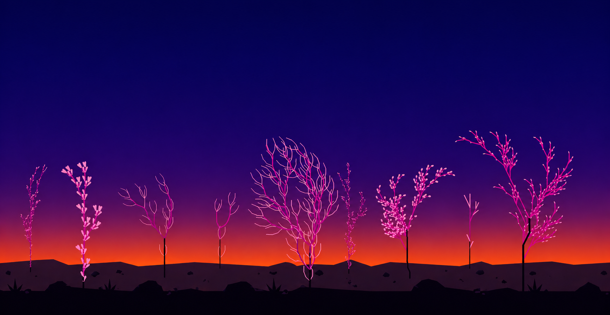
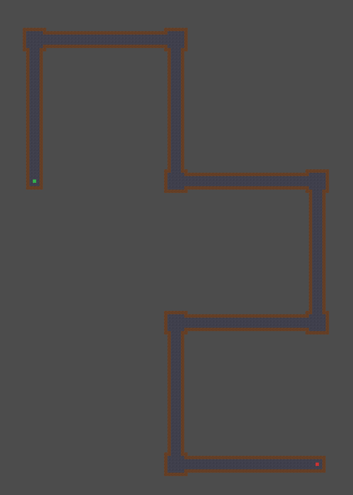
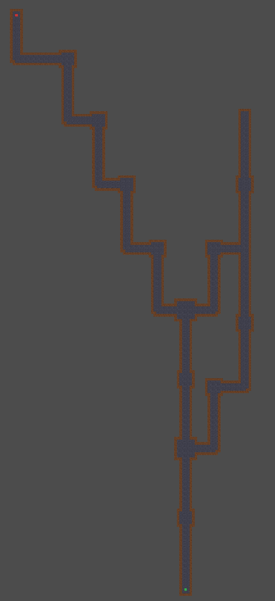
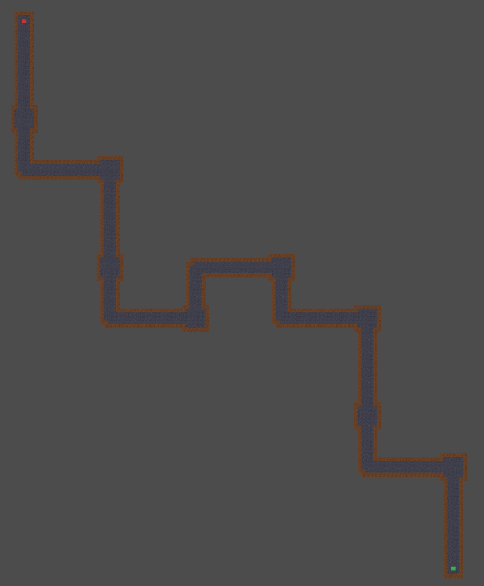
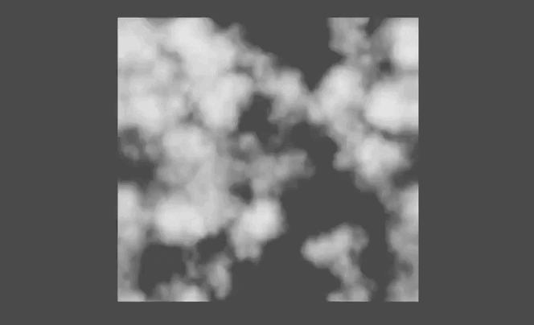
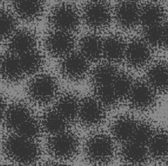
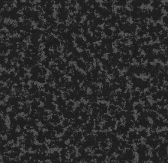
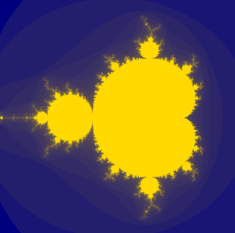
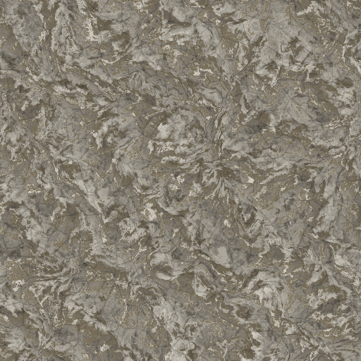
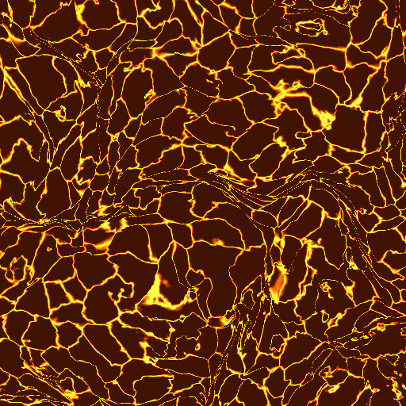

# ProceduralShader

Набор плагинов для Godot Engine 4.3, реализующих инструментарий процедурной генерации текстур с возможностью экспорта.


## Обзор

Проект состоит из двух плагинов, встраиваемых в редактор Godot как dock-панели:

**Procedural Baker** — универсальный инструмент для работы с canvas_item шейдерами. Автоматически анализирует параметры произвольного шейдера, динамически генерирует визуальный редактор, показывает превью в реальном времени и позволяет отрендерить результат в PNG с сохранением метаданных.

**L-System Editor** — редактор L-систем (формальных грамматик Линденмайера) с поддержкой стохастических правил, пятью режимами окраски, системой пресетов и экспортом в пять форматов: PNG, Path2D, Path3D, граф JSON, граф ресурс Godot (.tres).

Дополнительно в проекте представлены **демонстрационные примеры**, показывающие практическое применение результатов генерации: текстуры для систем частиц, фон игровой сцены из PNG-деревьев, генерация планировки подземелья по графу L-системы, построение трёхмерного дерева по экспортированному Path3D, а также сравнение производительности между тяжёлыми процедурными шейдерами и предварительно отрендеренными текстурами.

---

## Содержание

- [Требования](#требования)
- [Установка](#установка)
- [Procedural Baker](#procedural-baker)
- [L-System Editor](#l-system-editor)
- [Демонстрационные примеры](#демонстрационные-примеры)
- [Сравнение текстур и шейдеров реального времени](#сравнение-текстур-и-шейдеров-реального-времени)
- [Шейдеры](#шейдеры)
- [Структура проекта](#структура-проекта)

---

## Требования

- **Godot Engine 4.3** (Forward+ renderer)

---

## Установка

### 1. Клонирование репозитория

```bash
git clone https://github.com/<username>/ProceduralShader.git
```

### 2. Открытие проекта

Откройте папку проекта через Godot Engine 4.3: `Project → Import → выбрать папку`.

### 3. Активация плагинов

Перейдите в `Project → Project Settings → Plugins` и включите:

- **Procedural Baker** — dock-панель появится в правой верхней части редактора
- **L-System Editor** — dock-панель появится в правой нижней части редактора

---

## Procedural Baker

### Что делает

Загружает любой `canvas_item` шейдер, автоматически распознаёт его uniform-параметры и строит визуальный редактор. Не нужно писать UI-код под каждый шейдер — плагин делает это сам.

### Как использовать

1. Поместите `.gdshader` файл в папку `res://shaders/`
2. Нажмите 🔄 — шейдер появится в выпадающем списке
3. Выберите шейдер — элементы управления сгенерируются автоматически
4. Настройте параметры — превью обновляется в реальном времени
5. Выберите разрешение (256 / 512 / 1024 / 2048)
6. Нажмите **«Сохранить текстуру»** — PNG и JSON-метаданные сохранятся в папку экспорта

### Поддерживаемые типы параметров

| Тип в шейдере | UI-элемент |
|---|---|
| `float` с `hint_range` | Слайдер с отображением значения |
| `float` без hint | SpinBox |
| `int` | SpinBox (целочисленный) |
| `bool` | CheckBox |
| `vec4` с `source_color` | ColorPickerButton |
| `vec2` | 2 × SpinBox (X, Y) |
| `vec3` | 3 × SpinBox (X, Y, Z) |
| `sampler2D` | Селектор шума (Perlin / Cellular / Simplex / Value) + загрузка из файла |

### Возможности

- Автоматическое сканирование шейдеров в `res://shaders/`
- Загрузка шейдера из произвольной папки через диалог выбора файла
- Фильтрация: отображаются только шейдеры типа `canvas_item`
- Встроенный генератор бесшовных шумовых текстур (4 типа)
- Два независимых viewport'а: превью (реальное время) и рендеринг (по запросу)
- Автоматическое определение и управление служебным параметром `baking_mode`
- Экспорт метаданных в JSON (параметры, дата, имя шейдера)
- Настраиваемый путь экспорта (сохраняется между сессиями)
- Интеграция с Unity: копирование PNG и метаданных в папку Unity-проекта

### Создание своего шейдера

```glsl
shader_type canvas_item;

uniform float scale: hint_range(1.0, 32.0) = 8.0;
uniform float threshold: hint_range(0.0, 1.0) = 0.5;
uniform vec4 color1: source_color = vec4(1.0, 1.0, 1.0, 1.0);
uniform vec4 color2: source_color = vec4(0.0, 0.0, 0.0, 1.0);
uniform sampler2D noise_texture: repeat_enable;
uniform bool baking_mode = false;

void fragment() {
    // ваш код генерации текстуры
    COLOR = vec4(result, 1.0);
}
```

Поместите файл в `res://shaders/`, нажмите 🔄 — плагин автоматически создаст элементы управления для всех параметров. Параметр `baking_mode` скрыт от пользователя и активируется автоматически при рендере.

### Демонстрация


---

## L-System Editor

### Что делает

Редактор L-систем — формальных грамматик Линденмайера. Поддерживает детерминированные и стохастические L-системы, визуализацию методом черепашьей графики, пять режимов окраски и экспорт в пять форматов.

### Как использовать

1. Выберите встроенный пресет или создайте свою L-систему
2. Нажмите **«Сгенерировать»**
3. Настройте параметры (угол, длина шага, итерации, зум)
4. Выберите режим окраски и настройте цвета
5. Выберите формат экспорта и нажмите **«Экспортировать»**

### Встроенные пресеты

| Пресет | Аксиома | Угол | Итерации | Тип структуры |
|---|---|---|---|---|
| Koch Curve | `F` | 90° | 4 | Фрактальная кривая |
| Sierpinski | `F-G-G` | 120° | 5 | Фрактальный треугольник |
| Plant | `X` | 25° | 5 | Ветвящееся растение |
| Dragon Curve | `FX` | 90° | 10 | Спиральный фрактал |

### Синтаксис L-систем

| Символ | Действие |
|---|---|
| `F`, `G` | Шаг вперёд с отрисовкой сегмента |
| `+` | Поворот на +угол |
| `-` | Поворот на −угол |
| `[` | Сохранить состояние в стек (начало ветви) |
| `]` | Восстановить состояние из стека (конец ветви) |

### Стохастические правила

Для одного символа можно задать несколько правил с весами. При генерации правило выбирается случайным образом пропорционально весам. Seed фиксируется для воспроизводимости результата.

### Режимы окраски

| Режим | Описание |
|---|---|
| **Единый цвет** | Все сегменты одного цвета |
| **По символам** | Каждый рисующий символ (F, G) — свой цвет |
| **Градиент** | Цвет определяется позицией сегмента в последовательности |
| **По диапазонам** | Пользовательские цветовые диапазоны в процентах |
| **По итерациям** | Классификация: ствол / ветви / кончики — с индивидуальным цветом и толщиной |

### Форматы экспорта

| Формат | Файл | Назначение |
|---|---|---|
| PNG изображение | `.png` + `.json` | Растровая текстура с метаданными |
| Path2D | `.tscn` | Иерархические 2D-пути для Godot |
| Path3D | `.tscn` | 3D-пути с распределением ветвей по окружности |
| Граф JSON | `.json` | Узлы, рёбра, список смежности |
| Граф ресурс | `.tres` | Нативный ресурс Godot с программным API |

### Дополнительные возможности

- Навигация: зум колёсиком, панорамирование средней кнопкой мыши, кнопки в интерфейсе
- Адаптивный квадратный превью
- Пользовательские пресеты (сохраняются в JSON между сессиями)
- Защита от переполнения (лимит 500 000 символов)
- Опция прозрачного фона при экспорте PNG
- Режим свечения для текстур частиц (дилатация + гауссово размытие)
- Генерация мипмапов при экспорте
- Выпрямление ствола при экспорте Path3D
- Настраиваемый путь экспорта

### Ресурс графа L-системы (LSystemGraphResource)

Экспортированный `.tres` файл содержит:
- Координаты узлов (`PackedVector2Array`)
- Рёбра с метаданными (символ, глубина)
- Список смежности
- Параметры генерации (аксиома, угол, шаг, итерации, seed)

Программный API ресурса:

```gdscript
var graph = load("res://export/lsystem/graph.tres") as LSystemGraphResource
var branches = graph.get_branch_points()   # узлы с 3+ соседями
var leaves = graph.get_leaf_nodes()         # узлы с 1 соседом
var pos = graph.get_node_position(0)        # позиция узла
var neighbors = graph.get_neighbors(0)      # соседи узла
```

### Демонстрация


---

## Демонстрационные примеры

### Текстуры для систем частиц

Фрактальные L-системы, экспортированные в PNG с прозрачным фоном и режимом свечения, используются как спрайты GPUParticles2D. Реализовано пять эффектов:

| Снегопад | Арканный взрыв | Магическая аура |
|:---:|:---:|:---:|
|  |  |  |

| Мистический вихрь | Руновый след |
|:---:|:---:|
|  |  |

### Фон игровой сцены

PNG-текстуры деревьев, сгенерированные в L-System Editor с окраской «По итерациям», размещены как спрайты для формирования фона леса.



### Генерация подземелья

JSON-граф L-системы используется для процедурной генерации планировки: узлы → комнаты, рёбра → коридоры. Размеры комнат зависят от количества соседей.

| | | |
|:---:|:---:|:---:|
|  |  |  |

### 3D-дерево

Path3D, экспортированный из L-System Editor, используется для генерации трёхмерного меша дерева с трубками переменного радиуса и листвой на терминальных точках.


---

## Сравнение текстур и шейдеров реального времени

В проекте представлена демонстрационная 3D-сцена **«Каменный зал»**, предназначенная для сравнения двух подходов к использованию процедурных материалов:

1. **Подготовленные текстуры** — PNG, предварительно сгенерированные через Procedural Baker
2. **Шейдеры реального времени** — spatial-шейдеры, вычисляемые на GPU каждый кадр

Сцена содержит архитектурные элементы из мрамора и лавы: пол, стены, потолок, колонны с базами и капителями, центральный постамент, лавовый канал, боковые бассейны с бортиками и лавовые потёки по дальней стене со свечением. Переключение между режимами выполняется кнопкой в интерфейсе.

### Тяжёлые шейдеры

Для мрамора и лавы используются вычислительно сложные шейдеры, каждый из которых существует в двух версиях:

| Шейдер | canvas_item (для текстур) | spatial (для 3D-сцены) |
|---|---|---|
| Мрамор | `heavy_marble.gdshader` | `heavy_marble_spatial.gdshader` |
| Лава | `heavy_lava.gdshader` | `heavy_lava_spatial.gdshader` |

Алгоритмы генерации в обеих версиях идентичны и включают:

- **FBM** (12–14 октав)
- **Domain warping** (4–5 итераций, каждая содержит вложенный FBM)
- **Voronoi** (поиск по 25 ячейкам)
- **Турбулентность** (для лавы)
- **Микродетали** (дополнительный проход FBM)

### Результаты сравнения

| Режим | FPS | Время кадра |
|---|---|---|
| Подготовленные текстуры | ~750 | ~1.4 ms |
| Шейдеры реального времени | ~250 | ~4.3 ms |

*Значения получены на конкретной аппаратной конфигурации при отключённом VSync. Результаты зависят от оборудования, но сцена демонстрирует устойчивую разницу в стоимости рендеринга.*


---

## Шейдеры

В проекте реализовано несколько демонстрационных процедурных шейдеров.

### Базовые шейдеры (canvas_item)

#### cloud_shader — Облака
Комбинация Perlin и Cellular шума с Gaussian blur (15×15 kernel). Два слоя шума перемножаются для создания пушистой структуры. Параметр `threshold` управляет плотностью облачности.

#### stone_shader — Камень
Perlin-шум смешивается с Voronoi-диаграммой, вычисляемой в шейдере (9 соседних ячеек). Voronoi создаёт зернистую структуру и трещины. Двухцветная палитра для настройки оттенков камня.

#### asphalt_shader — Асфальт
Три октавы шума с нестандартными частотами (×1.0, ×2.3, ×4.7) для нерегулярной текстуры. Степенная функция `pow(x, 1.5)` усиливает контраст.

#### fractal_shader — Фрактал Мандельброта
Классическое множество Мандельброта со 100 итерациями. Цветовой маппинг через `sqrt` для плавных переходов. Параметр `scale` управляет зумом в комплексную плоскость.

### Тяжёлые шейдеры (для демонстрации пользы предварительного рендера)

#### heavy_marble — Детализированный мрамор
Domain warping + FBM (12 октав) + Voronoi-трещины + микродетали. Создаёт реалистичную мраморную текстуру с прожилками.
- `heavy_marble.gdshader` — canvas_item, для создания текстуры через Procedural Baker
- `heavy_marble_spatial.gdshader` — spatial, для рендеринга в 3D-сцене сравнения

#### heavy_lava — Детализированная лава
Domain warping + турбулентный шум (14 октав) + Voronoi-структуры + эмиссия. Создаёт лавовую текстуру с коркой и раскалёнными трещинами.
- `heavy_lava.gdshader` — canvas_item, для текстуры
- `heavy_lava_spatial.gdshader` — spatial, для рендеринга в реальном времени

### Примеры сгенерированных текстур

| Облака | Камень | Асфальт | Фрактал |
|:---:|:---:|:---:|:---:|
|  |  |  |  |

| Мрамор | Лава |
|:---:|:---:|
|  |  |

---

## Структура проекта

```
res://
├── addons/
│   ├── procedural_baker/
│   │   ├── plugin.cfg
│   │   ├── procedural_baker_plugin.gd    ← EditorPlugin
│   │   ├── baker_dock.tscn               ← UI dock-панели
│   │   ├── baker_dock.gd                 ← Логика Baker
│   │   ├── shader_inspector.gd           ← Анализ шейдеров + генерация UI
│   │   └── texture_exporter.gd           ← Рендер + экспорт
│   └── lsystem_editor/
│       ├── plugin.cfg
│       ├── lsystem_plugin.gd             ← EditorPlugin
│       ├── lsystem_dock.tscn             ← UI dock-панели
│       ├── lsystem_dock.gd               ← Логика L-систем
│       └── lsystem_graph_resource.gd     ← Ресурс графа L-системы
├── shaders/
│   ├── cloud_shader.gdshader
│   ├── stone_shader.gdshader
│   ├── asphalt_shader.gdshader
│   ├── fractal_shader.gdshader
│   ├── heavy_marble.gdshader             ← Мрамор (canvas_item, для текстур)
│   ├── heavy_lava.gdshader               ← Лава (canvas_item, для текстуры)
│   ├── heavy_marble_spatial.gdshader     ← Мрамор (spatial, для 3D-сцены)
│   ├── heavy_lava_spatial.gdshader       ← Лава (spatial, для 3D-сцены)
│   └── ...
├── demo/
│   ├── dungeon/
│   │   ├── dungeon_demo.tscn             ← Демо генерации подземелья
│   │   ├── dungeon_demo.gd
│   │   └── dungeon_generator.gd          ← Генератор подземелья по графу
│   ├── tree3d/
│   │   ├── tree_demo.tscn                ← Демо 3D-дерева
│   │   ├── tree_demo.gd
│   │   └── tree_generator.gd             ← Генератор меша дерева по Path3D
│   ├── particles/
│   │   ├── particle_demo.tscn            ← Демо систем частиц
│   │   ├── particle_demo.gd
│   │   └── textures/                     ← Текстуры L-систем для частиц
│   └── bake_comparison/
│       ├── bake_comparison_demo.tscn     ← Сравнение шейдеров и подготовленных текстур
│       ├── bake_comparison_demo.gd
│       └── textures/                     ← PNG-текстуры для сравнения
├── export/                               ← Папка экспорта (создаётся автоматически)
└── project.godot
```


